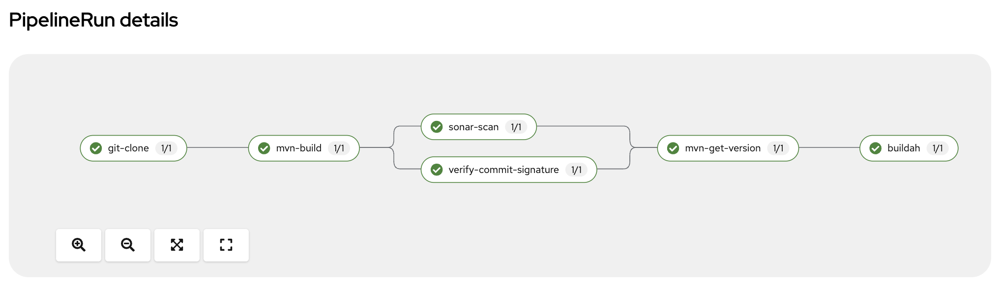

# README

## Introduction
This project tries to automate the build and deployment of a Quarkus application using Tekton Pipelines.

## Pre-requisites
1. A Github account to store the code.
2. An Openshift cluster
3. A GPG key to sign the code commits.
4. A Quay.io account to store the container images.
5. Sonarqube instance to analyze the code quality.

## Pipeline resources:
* The pipeline 
* Custom Tasks
* The Triggers 
* Supporting resources:
  * PVC
  * Secrets
  * Config Map

## Pipeline
The pipeline is defined in the file `pipeline.yaml`. It contains the following tasks:



## Install the pipeline
```shell
helm install java-pipeline .
```  

Trigger the pipeline
```bash
$ tkn pipeline start java-pipeline \
    -p git-url=https://github.com/anmiralles/quarkus-fruits-api.git \
    -p image=quay.io/rh-ee-amiralle/quarkus-fruits-api \
    -w name=shared-workspace,claimName=java-pipeline-pvc \
    -w name=dockerconfig,secret=quay-secret \
    --use-param-defaults
```

Log progress as shown. If there are two or more running, the shell is interactive to allow you to pick correct log
```shell
$ tkn pipeline logs -f
? Select pipelinerun:  [Use arrows to move, type to filter]
> build-and-deploy-run-xy7rw started 36 seconds ago
  build-and-deploy-run-z2rz8 started 40 seconds ago
```

Re-run last pipeline
```shell
$ tkn pipeline start build-and-deploy --last
```
## Related information

https://docs.github.com/en/authentication/managing-commit-signature-verification/adding-a-gpg-key-to-your-github-account
https://tekton.dev/docs/

